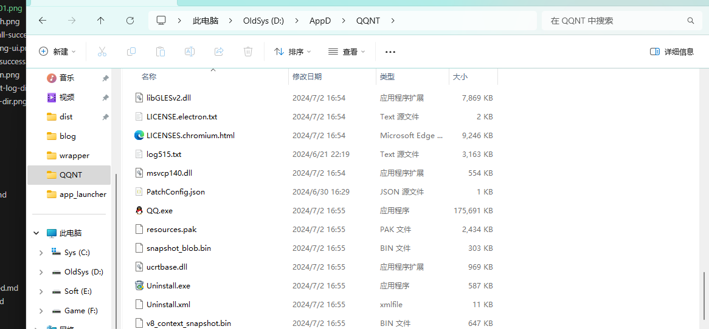

# 安装

## 下载NapCatQQ与安装QQ
确保你知道NC和QQ的位置
## 如果是Linux 平台 你需要做
安装xvfb（参考 https://github.com/NapNeko/NapCat-Installer/blob/main/script/install.sh ）

## 如果是Win平台 你需要做
[修补QQ](https://liteloaderqqnt.github.io/guide/install.html#%E4%BF%AE%E8%A1%A5)

请按照教程修补QQ 如果此前安装LiteLoaderQQNT 可跳过 当然也可以使用他的一键工具 然后按照下面修改

## 打开QQ下对应目录


## 解压
将napcat放置到如上图的位置 确保 ./napcat/napcat.mjs 存在！！！！
把NC放到QQ如上图的位置

## 写入启动代码
### Windows
将上图中的QQ目录的index.js内容删除后添加如下代码 添加后保存
```js

const path = require('path');
const CurrentPath = path.dirname(__filename);
await import("file://" + path.join(CurrentPath, './napcat/napcat.mjs'));
require('./launcher.node').load('external_index', module);
```
### Linux
Linux同样也需要修改index.js（这个文件一般在`\opt\QQ\resources\app\app_launcher`）如下
```js

const path = require('path');
const CurrentPath = path.dirname(__filename);
await import("file://" + path.join(CurrentPath, './napcat/napcat.mjs'));
require('./launcher.node').load('external_index', module);
```
## 启动Win NapCat
打开NTQQ目录


### Win 一键启动脚本
<!-- [参考脚本](https://github.com/NapNeko/NapCatQQ/blob/main/script/NapCat.164.bat) -->

napcat-9912 为新的启动脚本，复制到任意位置双击打开即可快速启动

### Win11
在空白处右键 在终端打开 然后在终端输入 这部是为了更方便获取webui状态 进入配置 不使用这步骤启动 而正常启动 则需要保证你知道webui工作位置 （查看webui配置条目）
```bash
./QQ.exe --enable-logging
```
即可启动
### Win10
在地址栏输入cmd回车 在启动后的窗口内 输入
```bash
./QQ.exe --enable-logging
```
即可启动
### Linux
```bash
qq
``` 
