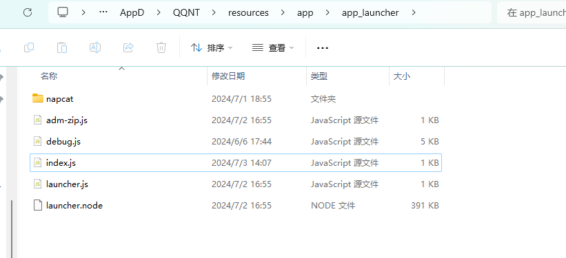

# BootWay03 撸猫教程（Only GUI）

首先，安装 QQ，确保你知道 QQ 的目录。Linux 一般在 `/opt/QQ`；Windows 一般在系统盘下 `Program Files\Tencent\QQNT`，具体定位方法可以参考 [BootWay05 教程](../shell/BootWay05.md)。

## 预处理

**Windows 平台**需要修补 QQ.exe，正如[安装 LiteLoaderQQNT](https://liteloaderqqnt.github.io/guide/install.html#%E4%BF%AE%E8%A1%A5) 时需要做的一样。请参考 LLQQNT 的教程修补 QQ，当然，如果安装过 LiteLoaderQQNT，这一步可以跳过。

## 准备文件



将 `NapCat.Shell.zip` 解压到 `${QQ 安装目录}/resource/app/app_launcher/napcat`，如上图。确保 `app_launcher/napcat/napcat.mjs` 存在！

## 写入启动代码

将上图中 QQ 目录的 index.js 修改为以下的内容并保存。请注意，此时可能需要获取管理员权限。

```js

const path = require('path');
const CurrentPath = path.dirname(__filename);
await import("file://" + path.join(CurrentPath, './napcat/napcat.mjs'));
require('./launcher.node').load('external_index', module);
```

## 启动

### Windows

在终端中启动 QQ，增加 `--enable-logging` 的 flag，这是为了方便获取控制台输出，以查看 NC 初始化状态和 WebUI 登入的凭据。

具体来说，可以启动一个工作目录在 NTQQ 的终端（参考 [BootWay05 教程](../shell/BootWay05.md)的手动安装部分），输入以下内容并回车：

``` bash
.\QQ.exe --enable-logging
```

### Linux

Linux QQ 在安装时即被加入 `PATH`，可以直接通过 `qq` 命令运行。
