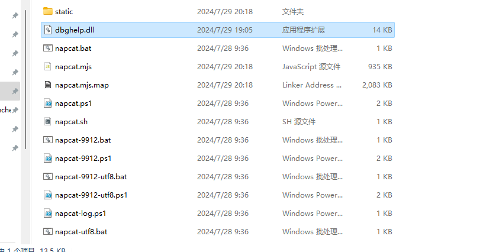
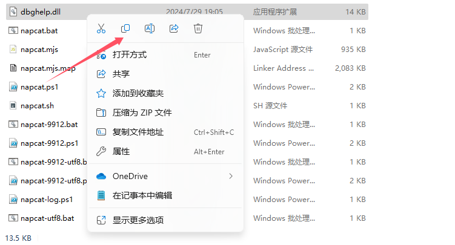
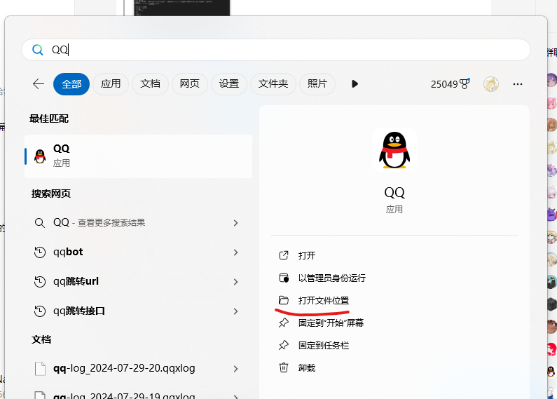
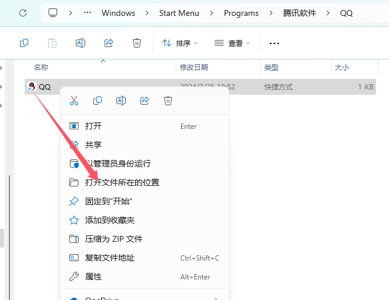
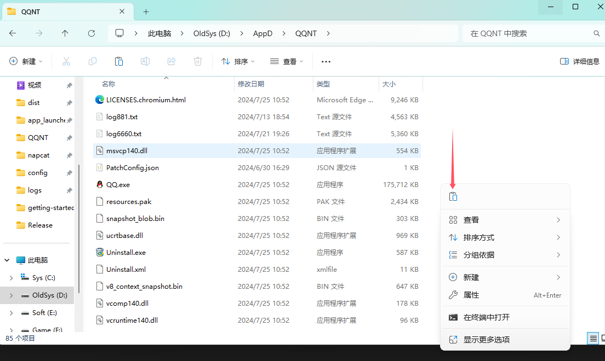
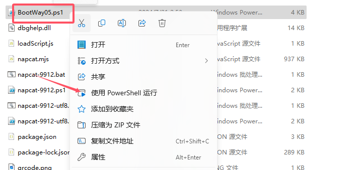

# BootWay05 撸猫教程

BootWay05 仅支持 Windows 64 位系统，需要确保你的电脑上安装 & 启用了 PowerShell，一般 Windows 10 / 11 系统是默认启用的。检测 PowerShell 是否存在可以通过在开始菜单中搜索，或在任何一个终端中输入 `powershell`，若成功启动 PowerShell 则存在。若不存在，请自行搜索教程配置。

下载 NapCat Shell 本体和 QQ，并安装 QQ。

## 替换文件

首先找到你下载的 NC 目录内的文件 `dbghelp.dll`： 


点击复制，完成后不要关闭文件管理窗口，否则会影响剪贴板。


进入 QQ 的安装位置。一般在系统盘下的 `Program Files\Tencent\QQNT`，或者也可以在开始菜单或 Windows 的快速搜索中找到 QQ 然后点击打开文件位置。



点击粘贴，覆盖原有的 `dbghelp.dll`。


## 首次启动

启动一个工作目录在 NC 目录的终端，输入
```
powershell -ExecutionPolicy ByPass -File ./BootWay05.ps1
```
并回车。

## 再次启动

再次运行只需要手动启动 PowerShell 脚本即可，如下图：

