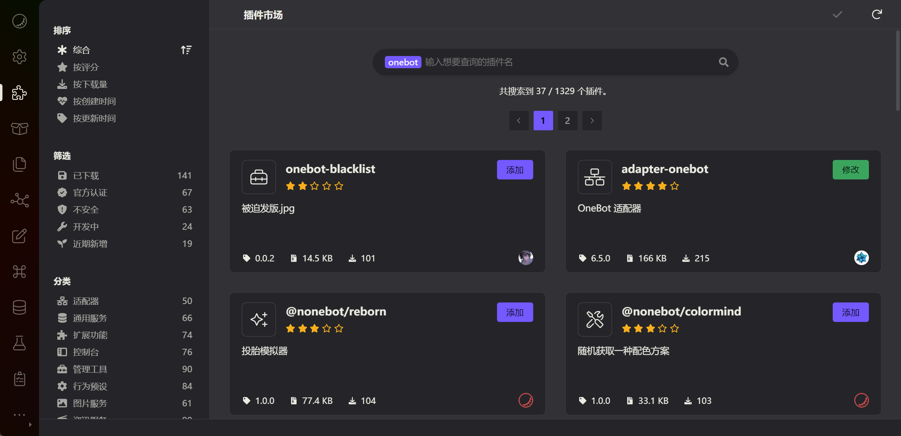
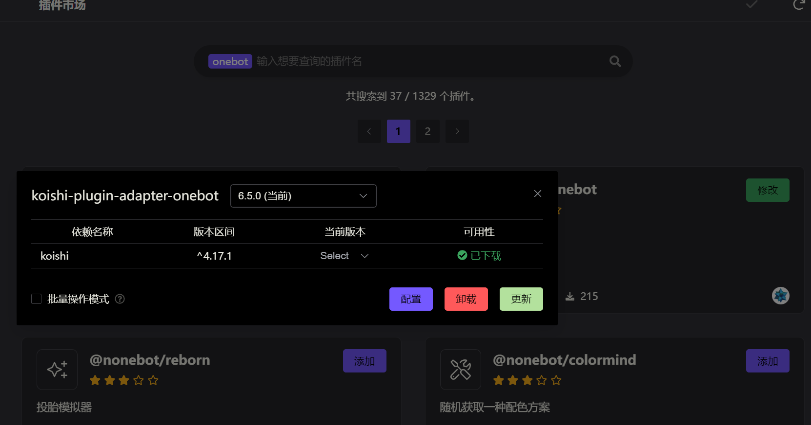
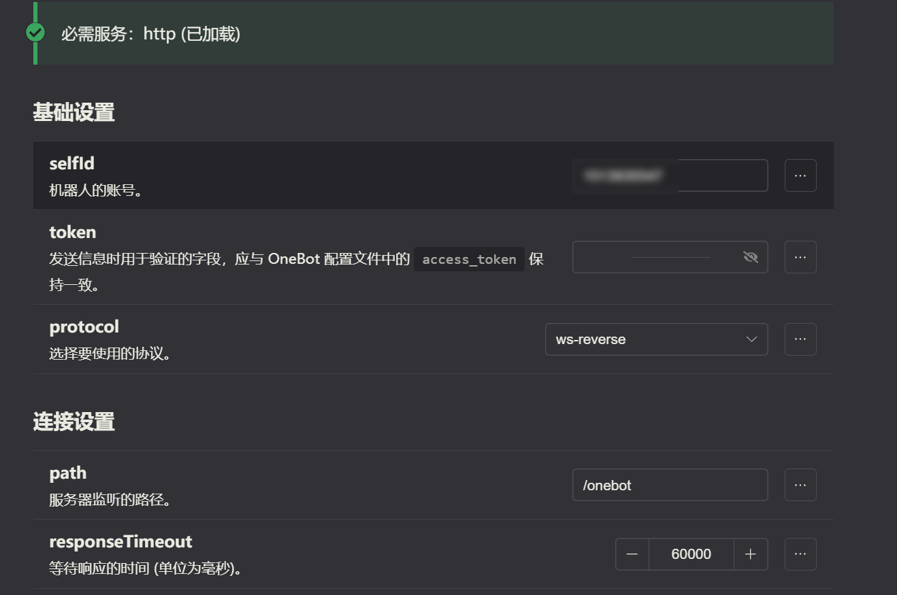

# 接入框架

## 对接开源框架

以 Koishi 和 NoneBot 为例。

::: details 配置 Koishi

1. 在 Koishi 插件市场搜索 `onebot` 并安装 `adapter-onebot`，如下图：

    

2. 安装完之后，点击修改→配置

    

3. 配置 OneBot

    这里以 WS 反向连接为例：
   - `selfId` 为你的机器人的 QQ 号
   - `token` 需和 NapCat 配置的 `token` 一致，当然，如果没有配置 token，则留空。
   - protocol 选择 ws-reverse

    其他配置保持默认即可，点击保存，然后启用插件。

    

    配置完成后，在 NapCat 的配置中添加 WS 反向地址。Koishi OneBot 的 ws 反向地址为 `ws://127.0.0.1:5140/onebot`。添加完成后，点击保存即可。

:::

::: details 配置 NoneBot

1. 配置 NoneBot

    这里假设你已经安装了 OneBot 适配器

    默认情况下，NoneBot 是启用了反向 ws 的，如果出现 403，可能是默认配置问题，需要配置 `token` 才能正常连接。具体方法为：修改 NoneBot 配置文件 `.env`，添加 `ONEBOT_ACCESS_TOKEN=你在 NapCat 中配置的 token`。

    然后，启动 NoneBot，可以看到 NoneBot 输出的端口号，如 `8080`。

2. 配置 NapCat

    在 NapCat 配置添加反向 ws 地址，地址为 `ws://127.0.0.1:8080/onebot/v11/ws`, 这里的 `8080` 是 NoneBot 输出的端口号，`/onebot/v11/ws` 是 NoneBot onebot 适配器默认的路径

    ::: tip
    时刻记得：NapCat 配置的 `token` 需要和 NoneBot 配置的一致！

:::

## 配置 HTTP 服务

HTTP 服务的配置主要有两方面：一方面是 HTTP 监听端口（应当由你的应用端来调用），另一方面是 HTTP 上报地址（由 NapCat 来调用你的应用端）。

::: details HTTP 监听端口

例如，配置的端口号为 `3000`，那么 API 地址为 `http://localhost:3000`。

:::

::: details HTTP 上报地址

当 NapCat 收到消息等事件时，会以 `POST` 请求的方式将事件上报到此地址。

::: tip

上报地址必须是 `http://` 开头

:::

## 配置 WebSocket 服务

OneBot 11 标准中，对“正向 WS”“反向 WS”的定义较为模糊，这里明确如下：正向指**接受**应用端的 WS 连接；反向指 NapCat 主动连接应用端监听的反向 WS 地址。

::: details 正向 WS 配置

例如，配置的端口号为 `3001`，那么需要在应用端配置的 WS 地址为 `ws://localhost:3001`。

:::

::: details 反向 WS 配置

例如，在 NoneBot2 配置 OneBot 的端口为 `8080`，路径为 `/onebot/v11/ws`，那么配置的反向 WS 地址为  `ws://localhost:8080/onebot/v11/ws`。

:::
