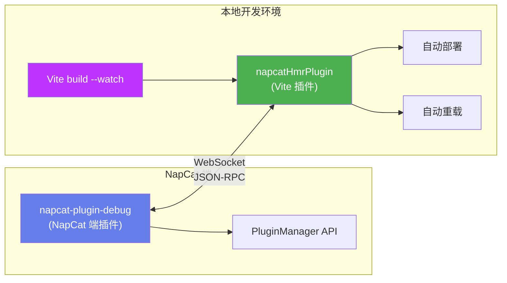
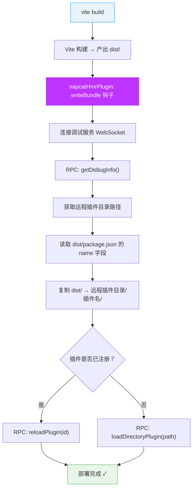
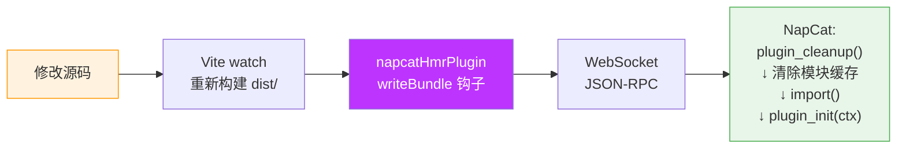

# 热重载开发

在传统的插件开发流程中，每次修改代码都需要手动构建、复制文件、重启 NapCat，效率较低。NapCat 提供了 **热重载（HMR）** 机制，允许你在开发过程中修改代码后自动重新加载插件，无需重启 NapCat。

::: tip 适用场景
热重载适用于 **本地开发和调试阶段**。当你完成开发并准备发布时，仍然使用 [发布插件](./publish.md) 中的标准流程。
:::

::: danger 安全警告
调试服务基于 WebSocket 通信，**默认不启用认证（无 token）**，任何能访问该端口的客户端都可以执行插件管理操作（加载、卸载、重载插件等）。

- **强烈建议在本地环境调试**（默认监听 `127.0.0.1`），避免远程调试
- **未配置 token 时，切勿将调试端口暴露在公网中**，否则任何人都可以连接并操控你的 NapCat 插件
- 如果确实需要远程调试，**必须同时启用认证并设置高强度 token**，且通过防火墙严格限制来源 IP
:::

## 架构概览

热重载机制由三个组件协同工作：



| 组件 | 说明 |
|-----|------|
| **[napcat-plugin-debug](https://github.com/NapNeko/napcat-plugin-debug)** | NapCat 端插件，启动 WebSocket 服务器（默认 `ws://127.0.0.1:8998`），将 PluginManager 的 API 暴露为 JSON-RPC 接口 |
| **napcatHmrPlugin** (Vite 插件) | 集成到 Vite 构建流程中，在每次 `writeBundle` 时自动连接调试服务、复制 dist/ 到远程、调用 reloadPlugin。来自 `napcat-plugin-debug-cli/vite` |
| **[napcat-plugin-debug-cli](https://www.npmjs.com/package/napcat-plugin-debug-cli)** | 可选的 CLI 工具，提供交互式 REPL、手动部署等功能 |

## 前置配置

### 1. NapCat 端：安装调试插件

在 NapCat 的插件市场中搜索并安装 `napcat-plugin-debug`（插件调试服务），启用后它会自动在 `ws://127.0.0.1:8998` 启动 WebSocket 调试服务。

::: details 调试服务配置项
在 NapCat WebUI 的插件配置中可以修改以下参数：

| 配置项 | 默认值 | 说明 |
|-------|--------|------|
| 调试服务端口 | `8998` | WebSocket 监听端口 |
| 监听地址 | `127.0.0.1` | **请勿改为 `0.0.0.0`，除非你清楚安全风险** |
| 启用认证 | `false` | 启用后客户端需提供 token |
| 认证 Token | 空 | 客户端连接时的认证 token |

> 默认配置仅监听本地回环地址 `127.0.0.1`，只有本机可以连接，这是最安全的方式。如果将监听地址改为 `0.0.0.0` 且未启用认证，等同于将插件管理权限完全暴露在网络中。

:::

### 2. 插件项目：安装依赖

在你的插件项目中，安装 `napcat-plugin-debug-cli` 和 `ws` 作为开发依赖：

```bash
pnpm add -D napcat-plugin-debug-cli ws
```

::: tip
如果你使用 [napcat-plugin-template](https://github.com/NapNeko/napcat-plugin-template) 模板，这些依赖和配置已经预置好，无需额外操作。
:::

### 3. 配置 Vite 插件

在 `vite.config.ts` 中引入并添加 `napcatHmrPlugin`（模板中已预置）：

```typescript
import { napcatHmrPlugin } from 'napcat-plugin-debug-cli/vite'

export default defineConfig({
  // ...其他配置
  plugins: [
    nodeResolve(),
    copyAssetsPlugin(),
    napcatHmrPlugin(),  // 构建完成后自动部署+重载
  ],
})
```

可选配置项：

```typescript
napcatHmrPlugin({
  wsUrl: 'ws://192.168.1.100:8998',  // 调试服务地址（默认 ws://127.0.0.1:8998）
  token: 'mySecret',                  // 认证 token
  enabled: true,                       // 是否启用（默认 true）
})
```

::: warning 关于远程连接
上述 `wsUrl` 指向远程地址仅作为示例。实际开发中 **建议在本地调试**（使用默认的 `ws://127.0.0.1:8998`）。如果你的 NapCat 运行在远程服务器上，请确保调试服务已启用 token 认证，并通过 SSH 隧道或防火墙限制访问，而非直接将端口暴露在公网。
:::

### 4. 配置 npm scripts

在 `package.json` 中添加以下脚本（模板中已预置）：

```json
{
  "scripts": {
    "build": "vite build",
    "push": "vite build",
    "dev": "vite build --watch"
  }
}
```

| 脚本 | 说明 |
|-----|------|
| `build` | 仅构建（如调试服务在线则自动部署） |
| `push` | 构建 + 自动部署到远程 + 重载插件 |
| `dev` | 持续构建 + 每次构建后自动部署 + 热重载 |

::: warning 不要使用 `deploy` 作为脚本名
pnpm 有内置的 `pnpm deploy` 命令（用于 workspace 部署），会覆盖 `package.json` 中的同名脚本，导致 `ERR_PNPM_CANNOT_DEPLOY` 错误。请使用 `push` 或其他名称代替。
:::

> 因为 `napcatHmrPlugin` 已集成到 Vite 构建流程中，所以 `push` 和 `dev` 只需要 `vite build` / `vite build --watch` 即可，无需额外启动 CLI 进程。

## 开发流程

### 一、首次部署

首次开发时，使用 `push` 命令将插件构建并部署到 NapCat：

```bash
pnpm run push
```

执行 `vite build` 时，Vite 插件 `napcatHmrPlugin` 会在构建完成的 `writeBundle` 钩子中自动执行部署流程：



#### 插件如何知道 NapCat 的插件目录？

Vite 插件 **不需要**你手动配置 NapCat 的安装路径。它的工作流程是：

1. 构建完成后，`napcatHmrPlugin` 连接 NapCat 端的 `napcat-plugin-debug` WebSocket 服务（默认 `ws://127.0.0.1:8998`）
2. 通过 JSON-RPC 调用 `getDebugInfo()` 方法，NapCat 返回当前实际的插件目录绝对路径
3. 读取 `dist/package.json` 的 `name` 字段，确定插件名称
4. 将 `dist/` 的内容复制到 `<远程插件目录>/<插件名>/` 下
5. 调用 `reloadPlugin` 或 `loadDirectoryPlugin` 触发热重载

这意味着无论 NapCat 安装在哪里，Vite 插件都能自动适配。整个流程在一个进程中完成，无需启动额外的 CLI。

### 二、持续开发（热重载）

完成首次部署后，使用 `dev` 命令进入热重载开发模式：

```bash
pnpm run dev
```

等价于带 `--watch` 的 `vite build`，只需要 **一个进程**：

1. **Vite watch 模式**：监听 `src/` 下的源码变更，自动重新构建到 `dist/`
2. **napcatHmrPlugin**：每次 `writeBundle`（构建完成）时自动部署到远程并调用热重载



**改一行代码，保存即生效，无需重启 NapCat。**

NapCat 端在收到重载指令后会：
1. 调用旧插件实例的 `plugin_cleanup()` 释放资源
2. 清除 Node.js 模块缓存
3. 重新 `import()` 加载新代码
4. 调用 `plugin_init(ctx)` 初始化新实例

::: warning 注意 plugin_cleanup
热重载依赖 `plugin_cleanup` 正确释放资源（如定时器、WebSocket 连接、事件监听器等）。如果不清理，可能导致重复注册或内存泄漏。请务必在 `plugin_cleanup` 中做好清理工作。
:::

### 三、交互调试（REPL）

直接运行 CLI 而不带 `--watch` 或 `--deploy` 参数，会进入交互式 REPL 模式：

```bash
npx napcat-debug
```

在 REPL 中可以使用以下命令：

| 命令 | 说明 |
|------|------|
| `list` | 列出所有插件及其加载状态 |
| `reload <id>` | 手动重载指定插件 |
| `load <id>` | 加载指定插件 |
| `unload <id>` | 卸载指定插件 |
| `info <id>` | 查看插件详细信息（路径、版本、状态等） |
| `deploy [dir]` | 部署插件到远程并重载 |
| `watch <dir>` | 启动文件监听 |
| `unwatch` | 停止文件监听 |
| `status` | 查看调试服务状态和 HMR 状态 |
| `ping` | 心跳测试（含延迟） |
| `quit` | 退出 |

## CLI 完整用法

> CLI 是独立的调试工具，提供 REPL 交互、手动部署等功能。日常开发推荐使用上述 Vite 插件方式（`pnpm run dev`），无需手动运行 CLI。

```bash
napcat-debug [ws-url] [options]
```

| 参数 | 说明 |
|-----|------|
| `ws://host:port` | 调试服务地址（默认 `ws://127.0.0.1:8998`） |
| `-t, --token <token>` | 认证 token（当调试服务启用认证时使用） |
| `-w, --watch <dir>` | 监听指定目录，文件变更时自动热重载 |
| `-W, --watch-all` | 监听远程插件目录下的所有插件 |
| `-d, --deploy [dir]` | 部署插件到远程并重载（默认当前目录） |
| `-v, --verbose` | 详细输出（显示事件通知等） |

### 常用组合

```bash
# 默认连接本地调试服务，进入 REPL
napcat-debug

# 连接远程 NapCat
napcat-debug ws://192.168.1.100:8998

# 带认证连接
napcat-debug --token mySecret

# 构建后一键部署
napcat-debug --deploy .

# 监听 dist/ 目录自动热重载
napcat-debug --watch ./dist

# 监听远程所有插件（用于直接编辑远程文件的场景）
napcat-debug --watch-all
```

## 完整数据流

```
源码修改 (src/)
    │
    ▼
Vite --watch 重新构建 → dist/
    │
    ▼
napcatHmrPlugin writeBundle 钩子
  → 复制 dist/ → 远程插件目录/<pluginName>/
    │
    ▼
WebSocket → JSON-RPC reloadPlugin(pluginId)
    │
    ▼
NapCat 端:
  1. plugin_cleanup(ctx)     — 卸载旧实例、释放资源
  2. 清除 Node.js 模块缓存    — 确保 import() 拿到新代码
  3. import(pluginEntry)      — 重新加载插件模块
  4. plugin_init(ctx)         — 初始化新实例、注册路由等
```

## 常见问题

### 热重载后插件行为异常？

检查 `plugin_cleanup` 是否正确清理了所有资源：
- 定时器（`clearInterval` / `clearTimeout`）
- WebSocket 连接
- 文件监听器
- 事件监听器

### 连接调试服务失败？

1. 确认 `napcat-plugin-debug` 已在 NapCat 中启用
2. 检查端口是否正确（默认 `8998`）
3. 如果启用了认证，确认 token 正确（Vite 插件通过 `napcatHmrPlugin({ token: '...' })` 配置）
4. 如果 NapCat 运行在远程机器上，建议通过 SSH 隧道转发端口（如 `ssh -L 8998:127.0.0.1:8998 user@server`），而非直接开放端口

### 安全最佳实践

| 场景 | 建议做法 |
|------|----------|
| 本地开发（NapCat 和编辑器在同一台机器） | 使用默认配置即可，无需额外设置 |
| 远程开发（NapCat 在远程服务器） | 使用 SSH 隧道转发端口，保持调试服务监听 `127.0.0.1` |
| 必须直接远程连接 | 启用认证 + 设置高强度 token + 防火墙限制来源 IP |
| 生产环境 | **不要启用调试插件**，仅在开发阶段使用 |

### 部署时提示 `dist/` 不存在？

先运行 `pnpm run build` 构建项目，确保 `dist/` 目录已生成。
