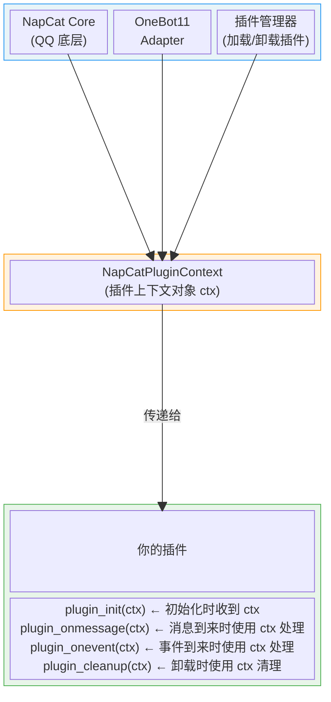
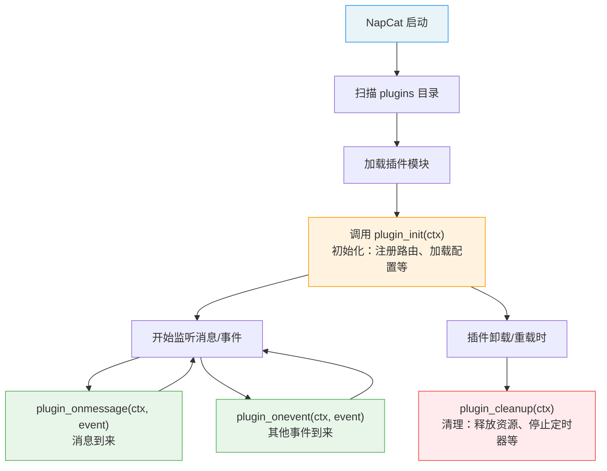

# 插件机制原理

在开始开发 NapCat 插件之前，了解插件系统的运作机制有助于更合理地设计和编写插件。

## 插件是什么？

NapCat 插件本质上是一个 **TypeScript/JavaScript 模块**，它被 NapCat 的插件管理器加载后，通过生命周期钩子与 NapCat 主程序进行交互。

插件的工作方式可以概括为：

> **NapCat 加载你的插件 → 传给你一个上下文对象 `ctx` → 你通过 `ctx` 调用 NapCat 提供的各种能力**

## 核心架构

整个插件系统由三个关键部分组成：



## ctx 能做什么？

`ctx`（即 `NapCatPluginContext`）是插件与 NapCat 交互的唯一桥梁。它提供了 **三个层次** 的能力：

### 层次一：调用 OneBot Action（最常用）

通过 `ctx.actions.call(...)` 调用标准的 OneBot11 协议 Action，这是最主要的使用方式。

```typescript
// 发送消息
await ctx.actions.call('send_msg', params, ctx.adapterName, ctx.pluginManager.config);

// 获取群列表
await ctx.actions.call('get_group_list', void 0, ctx.adapterName, ctx.pluginManager.config);

// 撤回消息
await ctx.actions.call('delete_msg', { message_id }, ctx.adapterName, ctx.pluginManager.config);
```

这些 Action 就是 NapCat 对外暴露的 OneBot11 API（如 `send_msg`、`get_group_list`、`set_group_ban` 等），与通过 HTTP/WebSocket 调用的 API 完全一致，只是插件内部可以直接调用，无需走网络请求。

::: tip API 查阅方式
- **使用 AI 查询**：官方插件模板 [napcat-plugin-template](https://github.com/NapNeko/napcat-plugin-template) 的 `.vscode/mcp.json` 中已预配置了 [napcat.apifox.cn](https://napcat.apifox.cn/) 的 MCP 服务器。使用 VS Code + GitHub Copilot 打开项目后，可以直接在 Copilot Chat 中用自然语言查询 OneBot 和 NapCat 提供的各种 API 接口。
- **手动查阅**：也可以直接访问 <https://napcat.apifox.cn/> 浏览完整的 API 文档。
:::

### 层次二：使用插件框架能力

`ctx` 还提供了一系列插件框架本身的能力，这些与 OneBot 协议无关：

| 能力 | 通过 | 用途 |
| --- | --- | --- |
| 路由注册 | `ctx.router` | 注册 HTTP API、静态文件、WebUI 页面 |
| 日志记录 | `ctx.logger` | 统一格式的日志输出 |
| 数据存储 | `ctx.dataPath` / `ctx.configPath` | 插件的数据和配置持久化 |
| 配置面板 | `ctx.NapCatConfig` | 在 WebUI 生成配置界面 |
| 插件管理 | `ctx.pluginManager` | 管理其他插件（查询、启停、加载） |
| 插件通信 | `ctx.getPluginExports()` | 获取其他插件的导出对象，实现插件间交互 |

### 层次三：访问 NapCat 底层（高级用法）

`ctx` 还暴露了 NapCat 的内部实例，允许执行标准 OneBot 协议之外的操作：

- `ctx.core` — NapCat 底层核心实例
- `ctx.oneBot` — OneBot11 适配器实例

::: warning 注意
直接使用 `ctx.core` 和 `ctx.oneBot` 属于高级用法，这些内部 API 可能在版本升级时发生变化。一般情况下优先使用 `ctx.actions.call(...)` 来调用标准 OneBot Action。
:::

## 插件的两种典型用途

根据你要实现的功能，NapCat 插件大致可以分为两种模式（或两者结合）：

### 模式一：Bot 功能型插件

这是最常见的模式。**监听消息/事件 → 调用 OneBot Action 做出响应。**

```typescript
// 典型流程：收到消息 → 处理 → 调用 OneBot Action 回复
export const plugin_onmessage = async (ctx, event) => {
    if (event.raw_message === 'ping') {
        // 通过 ctx.actions 调用 OneBot Action 发送消息
        await ctx.actions.call('send_msg', {
            message: 'pong',
            message_type: event.message_type,
            group_id: String(event.group_id),
        }, ctx.adapterName, ctx.pluginManager.config);
    }
};
```

适用场景：关键词回复、命令处理、定时任务、消息转发、群管理等。

### 模式二：WebUI 功能型插件

不处理任何 QQ 消息，**仅通过 `ctx.router` 注册路由和页面**，在 NapCat 的 WebUI 中提供额外的管理界面或工具。

```typescript
export const plugin_init = async (ctx) => {
    // 注册一个 WebUI 页面
    ctx.router.page({
        path: 'dashboard',
        title: '数据面板',
        htmlFile: 'webui/index.html',
    });

    // 注册 API
    ctx.router.getNoAuth('/stats', (req, res) => {
        res.json({ code: 0, data: { visits: 42 } });
    });
};
```

适用场景：数据可视化面板、配置管理工具、系统监控等。

### 模式三：两者结合

实际开发中，很多插件会 **同时** 使用这两种模式 —— 处理消息的同时提供一个 WebUI 管理界面。官方插件模板 [napcat-plugin-template](https://github.com/NapNeko/napcat-plugin-template) 就是这种模式的典型示例。

::: info 关于插件模板
[napcat-plugin-template](https://github.com/NapNeko/napcat-plugin-template) 会随着 NapCat 项目的更新而持续调整（如 API 变化、最佳实践优化等）。建议开发前以模板仓库的最新版本为准，并关注仓库的 Release 和 README 以了解变更。
:::

## 生命周期概览

NapCat 通过调用你导出的特定函数来驱动插件运行：



## 与外部 OneBot 框架的区别

既然可以通过 HTTP/WebSocket 调用 OneBot API，为什么还需要插件？以下是两种方式的对比：

| 对比项 | 外部 OneBot 客户端 | NapCat 插件 |
| --- | --- | --- |
| 通信方式 | 网络请求 (HTTP/WS) | 直接函数调用 |
| 部署方式 | 独立进程/独立服务 | 嵌入 NapCat 内部 |
| 性能 | 有网络开销 | 零网络开销，直接调用 |
| 能力范围 | 仅限 OneBot 协议 | OneBot + NapCat 内部 API |
| WebUI 集成 | 需要独立搭建前端 | 直接嵌入 NapCat WebUI |
| 用户安装 | 需要额外配置 | 放入 plugins 目录即可 |

综上，插件是一种更轻量、集成度更高的开发方式，适用于需要与 NapCat WebUI 联动或对性能有较高要求的场景。

## 下一步

- [快速开始开发插件](./index.md)
- [项目结构与最佳实践](./structure.md)
- [热重载开发](./hot-reload.md) — 改代码即时生效，提升开发效率
- [插件 API 参考](./api/doc.md)
