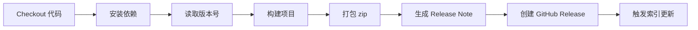
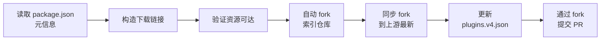

# 发布插件

本章节将详细介绍如何通过 CI/CD 自动化流程发布你的 NapCat 插件，并将其收录到官方插件索引中。

::: tip 前提条件
- 你已经基于 [napcat-plugin-template](https://github.com/NapNeko/napcat-plugin-template) 创建了自己的插件仓库
- 插件代码已经开发完成，并可以正常构建
- 你有一个 GitHub 账号
:::

## 整体流程

整个发布流程是自动化的，只需完成两步操作：**配置 Secrets** 和 **推送 tag**。


模板仓库内置了两个 GitHub Actions 工作流，分别负责：

| 工作流文件 | 功能 |
|-----------|------|
| `release.yml` | 自动构建项目、打包 zip、创建 GitHub Release |
| `update-index.yml` | Release 发布后，自动向插件索引仓库提交更新 PR |

## 第一步：填写插件元信息

编辑你的 `package.json`，确保以下字段已正确填写：

```json
{
    "name": "napcat-plugin-your-name",      // [!code highlight] 插件唯一 ID，必须以 napcat-plugin- 开头
    "plugin": "你的插件显示名",               // [!code highlight] 在插件市场中显示的名称
    "version": "1.0.0",
    "description": "插件功能描述",
    "author": "你的名字",
    "napcat": {                              // [!code highlight] 索引专用字段
        "tags": ["工具"],                    // [!code highlight] 插件标签，见下方可用标签
        "minVersion": "4.14.0",             // [!code highlight] 支持的最低 NapCat 版本
        "homepage": ""                       // [!code highlight] 留空则默认使用仓库地址
    }
}
```

### 命名规范

- `name` 字段（即插件 ID）**必须**以 `napcat-plugin-` 开头
- 仅允许**小写字母、数字和短横线** `-`，禁止使用中文或大写字母
- 例如：`napcat-plugin-music`、`napcat-plugin-group-manager`

### 可用标签

以下标签可在 `napcat.tags` 数组中使用：

`官方` `工具` `娱乐` `AI` `群管` `管理` `自动化` `语音` `表情` `撤回` `游戏` `音乐` `图片` `视频` `搜索` `翻译` `天气` `签到` `抽奖` `其他`

## 第二步：配置仓库 Secrets

在你的**插件仓库**的 **Settings > Secrets and variables > Actions** 中，需要添加以下 Secret：

### 必选配置

| Secret 名称 | 说明 |
|------------|------|
| `INDEX_PAT` | GitHub Personal Access Token，用于自动 fork 索引仓库并提交 PR |

::: details 如何创建 Personal Access Token (PAT)

**推荐方式：Classic Token（简单快速）**

1. 进入 GitHub **Settings > Developer settings > Personal access tokens > Tokens (classic)**
2. 点击 **Generate new token (classic)**
3. 设置名称，例如 `napcat-plugin-index`
4. 勾选 `public_repo` 权限（位于 `repo` 下）
5. 设置合理的过期时间
6. 点击 **Generate token**，**立即复制并保存**，此 Token 只会显示一次
7. 回到你的插件仓库，在 **Settings > Secrets and variables > Actions** 中添加名为 `INDEX_PAT` 的 Secret，值为上一步复制的 Token

**备选方式：Fine-grained Token（更精确的权限控制）**

1. 进入 GitHub **Settings > Developer settings > Personal access tokens > Fine-grained tokens**
2. 点击 **Generate new token**
3. 设置名称，例如 `napcat-plugin-index`
4. **Resource owner** 选择你自己的账号
5. **Repository access** 选择 **All repositories**（因为 CI 会自动 fork 索引仓库到你的账号下）
6. 展开 **Repository permissions**，设置以下权限：
   - **Contents**: `Read and write`（推送分支到 fork 仓库）
   - **Pull requests**: `Read and write`（创建 PR）
   - **Workflows**: `Read and write`（触发工作流）
7. 设置合理的过期时间
8. 点击 **Generate token**，**立即复制并保存**
9. 回到你的插件仓库，添加名为 `INDEX_PAT` 的 Secret

:::

::: tip 无需手动 fork 索引仓库
工作流会**自动完成**以下操作，你只需配置 `INDEX_PAT` 即可：

1. 通过 PAT 获取你的 GitHub 用户名
2. 自动 fork [napcat-plugin-index](https://github.com/NapNeko/napcat-plugin-index) 到你的账号下（如果尚未 fork）
3. 同步 fork 到上游最新状态
4. 将更新推送到你的 fork
5. 从 fork 向官方仓库发起 PR
:::

### 可选配置（AI Release Note）

如果你希望每次发布时自动用 AI 生成 Release Note，可以额外配置：

| Secret 名称 | 必填 | 说明 |
|------------|------|------|
| `AI_API_URL` | 是 | 兼容 OpenAI 格式的 API 地址（如 `https://api.openai.com/v1/chat/completions`） |
| `AI_API_KEY` | 是 | 对应的 API 密钥 |
| `AI_MODEL` | 否 | 模型名称，默认 `gpt-4o-mini` |

::: tip
不配置 AI 相关 Secret 不影响发布流程。未配置或 AI 调用失败时，会自动回退到默认的 Release Note 模板。
:::

## 第三步：发布！

配置完成后，执行以下命令即可触发发布流程：

```bash
git tag v1.0.0
git push origin v1.0.0
```

推送 `v*` 格式的 tag 后，CI 将自动完成后续所有步骤。

你也可以在 GitHub 仓库页面的 **Actions** 标签页中，手动触发 `Build and Release` 工作流并填入版本号。

## CI 工作流详解

### release.yml — 自动构建与发布

这个工作流在你推送 `v*` tag 或手动触发时执行，完成以下任务：



#### 核心步骤说明

**1. 版本号解析**

CI 会按优先级获取版本号：
- 手动触发时输入的版本号
- tag 名称（如 `v1.0.0` → `1.0.0`）
- 自动生成时间戳版本（兜底）

**2. 构建与打包**

执行 `pnpm run build` 构建项目后，自动将产物打包为 zip 文件：

```
release/
├── index.mjs       # 插件主入口
├── package.json    # 精简后的 package.json
└── webui/          # WebUI 构建产物（如有）
```

::: warning 修改插件名称
如果你的插件不叫 `napcat-plugin-template`，需要修改 `release.yml` 中 **Prepare release package** 步骤的 `PLUGIN_NAME` 环境变量为你的实际插件名。
:::

**3. Release Note 生成**

- 如果配置了 AI Secret → 使用 AI 根据 commit 记录生成结构化 Release Note
- 如果未配置或 AI 调用失败 → 使用 `.github/prompt/default.md` 模板回退
- 如果模板也不存在 → 直接使用 commit log

你可以自定义 AI 的提示词，在 `.github/prompt/release_note_prompt.txt` 文件中修改即可。

**4. 触发索引更新**

Release 创建成功后，会通过 `workflow_dispatch` 自动触发 `update-index.yml` 工作流。

::: info 为什么要手动触发？
因为 GitHub Actions 中，由默认 `GITHUB_TOKEN` 创建的 Release **不会**自动触发 `on.release` 事件。所以 `release.yml` 在最后一步通过 API 手动触发索引更新工作流。
:::

### update-index.yml — 自动更新插件索引

这个工作流在 Release 发布后被触发，完成以下任务：



#### 核心步骤说明

**1. 提取元信息**

CI 会从你的 `package.json` 中自动读取：

| 字段来源 | 映射到索引字段 |
|---------|-------------|
| `name` | `id` |
| `plugin` (或 `name`) | `name` |
| `description` | `description` |
| `author` | `author` |
| `napcat.tags` | `tags` |
| `napcat.minVersion` | `minVersion` |
| `napcat.homepage` (或 `homepage`) | `homepage` |

下载链接会自动构造为：`https://github.com/<你的仓库>/releases/download/<版本号>/<插件ID>.zip`

**2. 验证资源可达**

CI 会 curl 检查下载链接是否可访问。如果第一次失败，会等待 30 秒后重试（因为 Release 资源上传可能有延迟）。两次都失败则跳过索引更新。

**3. 自动 fork 与同步**

CI 会通过 GitHub API 自动完成以下操作：

- 使用 `INDEX_PAT` 获取你的 GitHub 用户名
- 检查你账号下是否已有 `napcat-plugin-index` 的 fork，如果没有则自动创建
- 调用 `merge-upstream` API 将 fork 同步到官方索引仓库的最新状态

**4. 提交 PR**

CI 会 checkout 官方索引仓库，使用 Node.js 脚本更新 `plugins.v4.json` 文件：

- 如果插件 ID 已存在 → 更新该条目
- 如果是新插件 → 追加到列表

然后通过 [peter-evans/create-pull-request](https://github.com/peter-evans/create-pull-request) Action 的 `push-to-fork` 功能，将更新推送到你的 fork 仓库，并从 fork 向官方索引仓库发起 PR。

::: info 为什么要通过 fork 提交？
你的 PAT 没有官方索引仓库 [napcat-plugin-index](https://github.com/NapNeko/napcat-plugin-index) 的写入权限，这是正常的。工作流自动将你的 fork 作为中转，完整流程是：

```
自动 fork 索引仓库 → 同步到上游最新 → 推送更新到 fork → 从 fork 向官方仓库发起 PR
```
:::

## 索引仓库的自动审核

你的 PR 提交到 [napcat-plugin-index](https://github.com/NapNeko/napcat-plugin-index) 后，索引仓库有一套完善的自动化审核流程：

| 工作流 | 触发条件 | 功能 |
|--------|---------|------|
| **PR 自动审核** (`validate-pr.yml`) | PR 修改 `plugins.v4.json` | 校验 JSON 格式、字段完整性、ID 唯一性、版本号格式、包名规范、下载链接可达性 |
| **校验结果评论** (`comment-on-pr.yml`) | 审核完成后 | 在 PR 中评论校验结果，自动打标签（新插件 / 插件更新 / 插件删除） |
| **AI 安全审计** (`security-scan.yml`) | PR 更新/新增插件 | 下载插件 zip 进行静态代码分析 + AI 深度审查，检测高危代码 |
| **链接定时巡检** (`check-links.yml`) | 每天定时执行 | 检查所有已索引插件的下载链接是否有效，失效时自动创建 Issue |

### 审核结果

- **校验通过 + 无安全风险** → 低风险 PR 自动合并，或等待维护者审核合并
- **校验未通过** → Bot 会在 PR 下评论具体的错误信息，你需要修复后重新提交
- **发现高危代码** → 需要人工审核

::: warning 常见校验失败原因
- 插件 ID 不符合 `napcat-plugin-xxx` 格式
- 必填字段为空
- `downloadUrl` 不是可访问的 `.zip` 链接
- 版本号不符合 [semver](https://semver.org/) 格式
- 插件包内 `package.json` 的 `name` 与索引中的 `id` 不一致
:::

## 版本更新发布

后续版本更新流程与首次发布完全一致：

1. 修改 `package.json` 中的 `version`（可选，CI 会以 tag 为准）
2. 推送新 tag：
   ```bash
   git tag v1.1.0
   git push origin v1.1.0
   ```
3. CI 自动构建、发布、更新索引

## 自定义 Release Note 模板

### 默认模板

在 `.github/prompt/default.md` 中自定义默认 Release Note 模板，支持 `{VERSION}` 占位符：

```markdown
## {VERSION}

### 核心更新
- 更新版本至 {VERSION}

### 安装说明
1. 下载 `你的插件名.zip`
2. 解压到 NapCat 的 `plugins` 目录
3. 重启 NapCat
```

### AI Prompt 自定义

在 `.github/prompt/release_note_prompt.txt` 中自定义 AI 生成 Release Note 的 system prompt，支持 `{VERSION}` 和 `{PREV_VERSION}` 占位符。

## 常见问题

### Q: 能不能手动提交 PR 到索引仓库？

不建议。索引仓库已采用全自动审核机制，手动提交的 PR 将不会被合入。请使用模板仓库的 CI 自动提交流程。

如果你不想使用模板仓库，请自行实现等效的 CI 工作流。

### Q: 不用模板仓库，自己写 CI 行不行？

可以，只要你的 CI 能够：

1. 构建产物并打包为 `<插件ID>.zip`（包含 `index.mjs`、`package.json`、`webui/`）
2. 创建 GitHub Release 并上传 zip
3. 向 `NapNeko/napcat-plugin-index` 仓库提交 PR，更新 `plugins.v4.json`

可以参考模板仓库的 [release.yml](https://github.com/NapNeko/napcat-plugin-template/blob/main/.github/workflows/release.yml) 和 [update-index.yml](https://github.com/NapNeko/napcat-plugin-template/blob/main/.github/workflows/update-index.yml)。

### Q: INDEX_PAT Token 过期了怎么办？

重新生成一个新的 PAT，更新仓库 Secret 即可。建议设置较长的过期时间，或使用 Fine-grained Token。

### Q: 提交 PR 到索引仓库时报 403 / Permission denied？

请检查以下几点：

1. **PAT 权限不足**：Classic Token 需要 `public_repo` 权限；Fine-grained Token 需要 `Contents: Read and write` + `Pull requests: Read and write` 权限，且 Repository access 需要选择 **All repositories**
2. **PAT 已过期**：重新生成并更新 Secret
3. **工作流版本过旧**：确保你使用的是最新版模板的 `update-index.yml`，新版工作流已内置自动 fork 功能，无需手动 fork 或修改工作流

### Q: Release 发布了但索引没更新？

检查 Actions 页面中 `update-index.yml` 的运行日志。常见原因：

- `INDEX_PAT` 未配置或已过期
- PAT 权限不足（见上一条）
- 下载链接验证失败（Release 资源尚未上传完成）
- `package.json` 中缺少必要字段

### Q: 下载链接验证失败？

GitHub Release 资源上传可能有延迟。CI 已内置 30 秒重试机制。如果仍失败，可以等资源上传完成后手动触发 `update-index.yml` 工作流。
