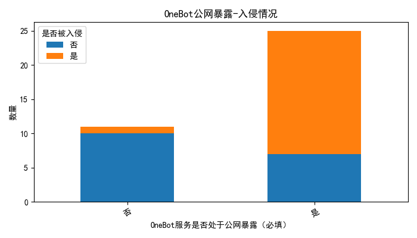
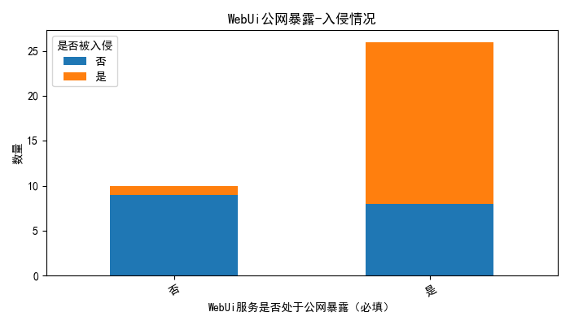
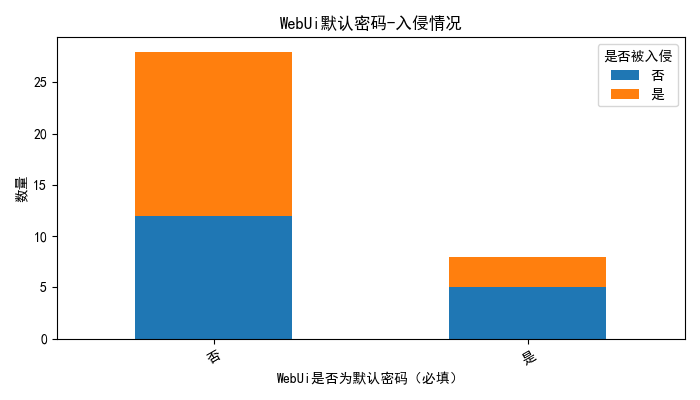

# 9月5日 OneBot 安全问题复盘
## 资料

## 前情提要
2025年9月5日，OneBot 生态内爆发了一场严重的安全事件，导致多个使用 OneBot 协议的机器人平台攻击，发送违法信息，甚至引发了大规模的网络攻击。作为主要沦陷框架将对事件的起因、经过及后续影响进行详细分析。

## 事件起因
经过数据分析和溯源，事件的起因被锁定在 OneBot 协议无Token问题上，大量用户采用一键包和一键脚本，暴露公网环境，导致攻击者通过扫描工具发现了大量暴露的 OneBot 机器人实例。

## 问题整理
- 大量用户不修改OneBot Token，导致攻击者可以轻易地通过空Token访问机器人实例。
- 受影响的主要为OneBot Http Server/WebSocket Server，攻击者通过发送恶意请求，控制机器人发送违法信息。
- 事件中，攻击者利用机器人发送了违法信息，甚至引发了大规模的网络攻击，影响范围广泛。
- NapCat 未提供随机OneBot Token默认随机填充 (部分用户偷懒)
- NapCat 多数服务以0.0.0.0 IPV4全监听，导致公网暴露 (方便用户致使问题)

## 其余安全问题
- NapCat 存在大量公网暴露的实例 WebUi也存在强安全风险 (并非此次事件问题)

## 意见
- 随机默认Onebot Token
- 可禁止局域网外访问
- 登录速率配置
- 登录随机化WebUi密钥
- 采用账号消息通知用户Token更新
- 强制要求用户登录后修改密码