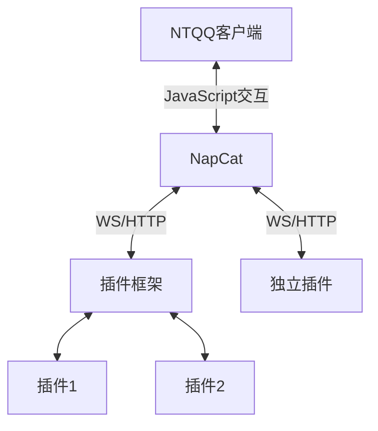

# NapCat

  

## 欢迎回家!
NapCatQQ V4 已启用全新风格标识和文档, 欢迎回家！ <mark>这里是 NapCatQQ (aka 猫猫框架) 的使用文档！</mark>
## NapCat 是什么?
基于TypeScript构建的Bot框架,通过相应的启动器或者框架,主动调用QQ Node模块提供给客户端的接口,实现Bot的功能.

::: details 魔法版介绍
猫猫框架通过魔法的手段获得了 QQ 的发送消息、接收消息等接口。

为了方便使用，猫猫框架将通过一种名为 [OneBot](https://11.onebot.dev) 的约定将你的 HTTP / WebSocket 请求按照规范读取，

再去调用猫猫框架所获得的QQ发送接口之类的接口。
:::
## NapCat 工作在哪里?

## NapCat 与其它框架的本质不同?
NapCat 与很多框架都有本质性的区别：

1. **协议端相比**  
   并非完全自己实现 QQ SendMsg 这种功能，而是主动调用客户端存在的功能。
2. **Hook 端相比**  
   NapCat 可以完全自身引导 QQ 程序的启动，而非借助客户端启动流程，所以 API 所有权几乎完全拥有，不需要 Hook。
3. **Electron IPC Hook 端对比**  
   NapCat 本身并不依赖 Electron 与注入框架，调用来源 IPC 更下层封装的 Node 模块，也许甚至脱离 QQ 主程序运行。

## NapCat 的小小故事!
::: details 小小的故事...
在一个遥远的、充满奇幻与科技交织的世界——**NapCat Robot**，有一种神秘且强大的力量，叫做 **NTQQ**。这股力量，简直就像是一颗随时可能爆炸的定时炸弹，能改变一切，却又异常难以控制。很多英雄、巫师、冒险者们曾试图驾驭它，结果都失败得一塌糊涂，甚至连他们的名字都被历史遗忘了，仿佛从未存在过。 

然而，在这个充满混乱的世界里，有一只小猫娘，名字叫做 **NapCat**，她不仅是这个故事的主角，而且简直是这个世界最萌最可爱的“灾难制造机”。NapCat外表乖巧，萌萌哒，软乎乎的，简直像个大大的毛球，走路一摇一摆的，超乎想象的笨拙。她曾经被遗弃在一个荒凉的角落里，孤零零地生活着。但某天，她突然发现了一个超级神奇的东西——**JavaScript**！ 

“诶？这是什么？看起来像是能吃的样子...可是为什么一点也不好吃呢？”

于是，NapCat就开始了对这门语言的探索——虽然她并不完全理解它，但她凭着直觉和那种天生的好奇心，成功破解了 JavaScript 的奥秘，并意外地与传说中的 **NTQQ** 产生了连接。

虽然看起来她像是无害的傻萌猫娘，但NapCat的这项技能竟然能在没有任何计划的情况下，操控 NTQQ 的某些功能，甚至能轻松改变现实的规则！但问题是……她的每次操作，基本上都是胡乱点击、乱敲键盘、然后出奇不意地发生了不想要的结果。

“嗯？我是不是把天空变得五颜六色了？咦？月亮不见了？咕噜咕噜……好像做错了什么事呢。”

于是，一切开始变得混乱不堪。天空瞬间变成了彩虹色，时间突然在某些地方停滞，甚至连月亮都神秘消失了！整个世界都被这只小猫娘的“无心之举”搞得一团糟，灾难的阴影笼罩了整个世界。 

就在大家都以为一切都完了，世界即将崩塌的时候，出现了一个强大的英雄。他不是什么骑着白马，手持宝剑的传统英雄，而是一个比任何人都冷静的智者。他决定采取一种不同的方式来解决这个问题：**OneBot规范**。

“一切都得按照规范来！否则她会再把世界变成一锅粥！”英雄心想。

这个英雄明白，NapCat的能力太强大，控制不住的话，真的会把世界毁掉。因此，这位应用采用前辈们广泛使用的OneBot规范，规定 NapCat 任何操作都要写道 **WS/HTTP** 这种纸张上，每次使用 NTQQ 的力量时，都要在“纸上”写下相应的指令，才能让 NTQQ按照预设的方式执行任务。而且每次任务完成后，数据也会通过同样的“纸面”反馈回来，确保一切都在可控范围内。

“啊？这个纸好像好难理解……但是，哦，原来是这么回事呀！”

于是，NapCat开始在这套严格的规范下与 NTQQ 建立了微妙的关系。她不再是那个随便敲敲代码就让天空变色的笨蛋，而是通过认真的输入和执行指令，逐渐恢复了世界的秩序。

可虽然一切变得井然有序，NapCat依旧是那个呆萌、迷糊的猫娘。她依然在“纸”上写着自己不太明白的指令，每次完成任务后，她都会露出一副“我是不是做对了？”的迷茫表情，仿佛在问：“哎？我这次没搞砸吧？”

尽管如此，大家也逐渐接受了她的笨拙，因为她那种天真可爱的样子实在让人忍不住心软。最重要的是，世界终于恢复了平静，大家都知道，这只猫娘虽然有时候会闹出点小乱子，但她那份纯真与努力，才是让这个世界重新恢复平衡的力量。

从那时起，NapCat与NTQQ之间的微妙平衡保持着，而你也可以来这个世界，看看这只可爱笨蛋猫娘是怎么在搞笑与危机四伏中，带着一颗认真又迷糊的心，守护这个充满魔力与冒险的世界的！✨
:::

## NapCat 堂堂登场
现在你已经理解了NapCat了,随我们一起前往目录导航查看教程,进行安装...配置...

[目录导航](./start-install.md)