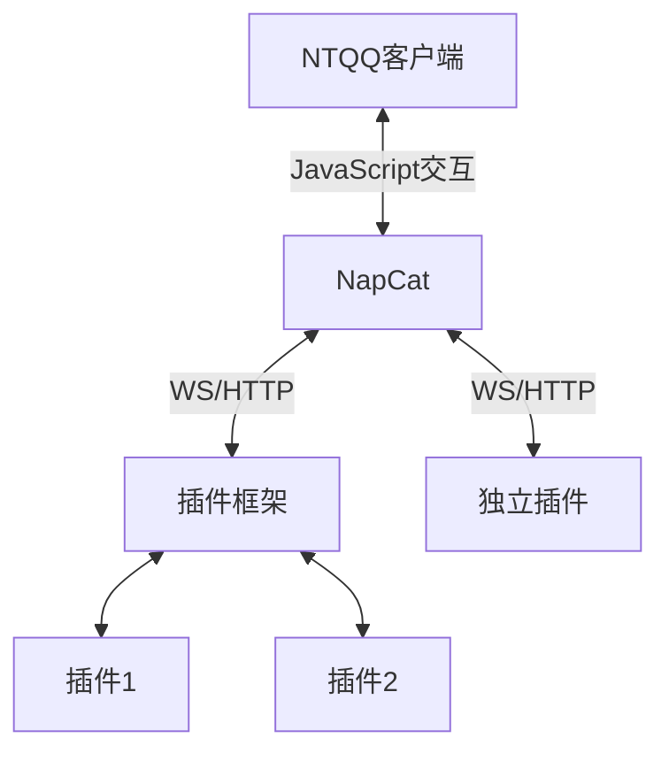

# NapCat

欢迎来到 NapCat Robot 的世界！接下来我将为你讲解一些入门知识。

此文档又名：如何驾驭 NapCat 快速踏入一阶魔法师。

## NapCat 施展了什么魔法



::: details 小小的故事...
在一个遥远的、充满奇幻与科技交织的世界——**NapCat Robot**，有一种神秘且强大的力量，叫做 **NTQQ**。这股力量，简直就像是一颗随时可能爆炸的定时炸弹，能改变一切，却又异常难以控制。很多英雄、巫师、冒险者们曾试图驾驭它，结果都失败得一塌糊涂，甚至连他们的名字都被历史遗忘了，仿佛从未存在过。 

然而，在这个充满混乱的世界里，有一只小猫娘，名字叫做 **NapCat**，她不仅是这个故事的主角，而且简直是这个世界最萌最可爱的“灾难制造机”。NapCat外表乖巧，萌萌哒，软乎乎的，简直像个大大的毛球，走路一摇一摆的，超乎想象的笨拙。她曾经被遗弃在一个荒凉的角落里，孤零零地生活着。但某天，她突然发现了一个超级神奇的东西——**JavaScript**！ 

“诶？这是什么？看起来像是能吃的样子...可是为什么一点也不好吃呢？”

于是，NapCat就开始了对这门语言的探索——虽然她并不完全理解它，但她凭着直觉和那种天生的好奇心，成功破解了 JavaScript 的奥秘，并意外地与传说中的 **NTQQ** 产生了连接。

虽然看起来她像是无害的傻萌猫娘，但NapCat的这项技能竟然能在没有任何计划的情况下，操控 NTQQ 的某些功能，甚至能轻松改变现实的规则！但问题是……她的每次操作，基本上都是胡乱点击、乱敲键盘、然后出奇不意地发生了不想要的结果。

“嗯？我是不是把天空变得五颜六色了？咦？月亮不见了？咕噜咕噜……好像做错了什么事呢。”

于是，一切开始变得混乱不堪。天空瞬间变成了彩虹色，时间突然在某些地方停滞，甚至连月亮都神秘消失了！整个世界都被这只小猫娘的“无心之举”搞得一团糟，灾难的阴影笼罩了整个世界。 

就在大家都以为一切都完了，世界即将崩塌的时候，出现了一个强大的英雄。他不是什么骑着白马，手持宝剑的传统英雄，而是一个比任何人都冷静的智者。他决定采取一种不同的方式来解决这个问题：**OneBot规范**。

“一切都得按照规范来！否则她会再把世界变成一锅粥！”英雄心想。

这个英雄明白，NapCat的能力太强大，控制不住的话，真的会把世界毁掉。因此，这位应用采用前辈们广泛使用的OneBot规范，规定 NapCat 任何操作都要写道 **WS/HTTP** 这种纸张上，每次使用 NTQQ 的力量时，都要在“纸上”写下相应的指令，才能让 NTQQ按照预设的方式执行任务。而且每次任务完成后，数据也会通过同样的“纸面”反馈回来，确保一切都在可控范围内。

“啊？这个纸好像好难理解……但是，哦，原来是这么回事呀！”

于是，NapCat开始在这套严格的规范下与 NTQQ 建立了微妙的关系。她不再是那个随便敲敲代码就让天空变色的笨蛋，而是通过认真的输入和执行指令，逐渐恢复了世界的秩序。

可虽然一切变得井然有序，NapCat依旧是那个呆萌、迷糊的猫娘。她依然在“纸”上写着自己不太明白的指令，每次完成任务后，她都会露出一副“我是不是做对了？”的迷茫表情，仿佛在问：“哎？我这次没搞砸吧？”

尽管如此，大家也逐渐接受了她的笨拙，因为她那种天真可爱的样子实在让人忍不住心软。最重要的是，世界终于恢复了平静，大家都知道，这只猫娘虽然有时候会闹出点小乱子，但她那份纯真与努力，才是让这个世界重新恢复平衡的力量。

从那时起，NapCat与NTQQ之间的微妙平衡保持着，而你也可以来这个世界，看看这只可爱笨蛋猫娘是怎么在搞笑与危机四伏中，带着一颗认真又迷糊的心，守护这个充满魔力与冒险的世界的！✨
:::

由此可以看出 使用NapCat必须保证NTQQ的客户端这一基础的存在, 于是使用流程大概为

0. 安装**对应版本**NTQQ (特殊情况不需要安装或安装器代为安装)

1. 下载你需要的NapCat版本

2. 遵照其详细教程启动NapCat本体

3. 进入WebUi 启动你需要HTTP/WS 客户端与服务端

4. 配置框架或者独立插件连接NapCat

## Release里面的文件有些什么呢

| 文件名称        |      注意事项      | 适用平台 |
| ------------- | :-----------: | -----------: | 
| NapCat.Framework.Windows.Once.zip | 一键包Framework包(不包含QQ) | Windows.AMD64 |
| NapCat.Framework.zip     |     Framework本体  | AnyPlat.AnyArch | 
| NapCat.Shell.zip |   Shell本体+启动器(不包含QQ)    | AnyPlat.AnyArch | 
| Win无头链接 |   Shell本体+启动器(包含QQ)    | Windows.AMD64 |
| Win有头链接 |   Framework本体+启动器(包含QQ)    | Windows.AMD64 |

## 思考思考
NapCat有着众多启动方式 这些启动方式 伴随各种特性

Shell 版本具有低内存 服务器部署简单的方案

Framework 版本是具有可以 人机一体 方便窥屏的方案

### Shell 启动/安装方式

- 适用教程 [方法1 - 作为 LiteLoader 插件启动](./boot/Framework.md) <- 推荐
- 适用教程 `方法3 - 原生使用 NapCatQQ 启动` <- 由于启动方式变更,暂不提供教程

### Framework 启动/安装方式
- 适用教程 [方法2 - 使用命令行启动](./boot/Shell.md) <- 推荐
- 适用教程 [方法2 - Arch手动配置](./boot/Shell-Linux-SemiAuto.md) <-Arch


## 安装完成！铛铛
安装后就可以执行 ```3. 进入WebUi 启动你需要HTTP/WS 客户端与服务端```

[前往WebUi配置教程](../config/basic.md)