# OneBot 事件系统结构详解

> 本文档详细说明 OneBot 事件系统的架构、事件类型及其继承关系

## 开篇讲解
NapCat 迭代周期非常快，如果你需要准确靠谱的定义应当 [源代码](https://github.com/NapNeko/NapCatQQ/tree/main/src/onebot/event) 查看.

这部分并不复杂，如果你有 IDE 并初始化依赖，可以轻松理解这部分的字段和定义。

## 目录

- [基础事件结构](#基础事件结构)
- [元事件 (Meta Event)](#元事件-meta-event)
- [通知事件 (Notice Event)](#通知事件-notice-event)
- [请求事件 (Request Event)](#请求事件-request-event)
- [消息事件 (Message Event)](#消息事件-message-event)
- [事件继承关系总结](#事件继承关系总结)

OneBot 事件系统包含多种不同类型的事件，所有事件都继承自 `OneBotEvent` 基类。事件按照类型分为四大类：元事件（Meta）、通知事件（Notice）、请求事件（Request）和消息事件（Message）。

## 基础事件结构

### OneBotEvent (基类)

所有事件的基类，定义了共有字段。

```typescript
abstract class OneBotEvent {
    time: number;         // 事件发生的时间戳
    self_id: number;      // 机器人自身 QQ 号
    abstract post_type: EventType; // 事件类型
}
```

### 事件类型枚举

```typescript
enum EventType {
    META = 'meta_event',      // 元事件
    REQUEST = 'request',      // 请求事件
    NOTICE = 'notice',        // 通知事件
    MESSAGE = 'message',      // 消息事件
    MESSAGE_SENT = 'message_sent', // 消息发送事件
}
```

## 元事件 (Meta Event)

> 元事件是与协议相关的事件，如心跳、生命周期等

### OB11BaseMetaEvent

```typescript
abstract class OB11BaseMetaEvent extends OneBotEvent {
    post_type = EventType.META;
    abstract meta_event_type: string; // 元事件类型
}
```

### OB11HeartbeatEvent

心跳事件，用于确认连接状态

```typescript
interface HeartbeatStatus {
    online: boolean | undefined,  // 是否在线
    good: boolean                 // 状态是否良好
}

class OB11HeartbeatEvent extends OB11BaseMetaEvent {
    meta_event_type = 'heartbeat'; // 心跳事件
    status: HeartbeatStatus;       // 状态信息
    interval: number;              // 心跳间隔时间(ms)
}
```

### OB11LifeCycleEvent

生命周期事件，用于通知框架生命周期变化

```typescript
enum LifeCycleSubType {
    ENABLE = 'enable',    // 启用
    DISABLE = 'disable',  // 禁用
    CONNECT = 'connect'   // 连接
}

class OB11LifeCycleEvent extends OB11BaseMetaEvent {
    meta_event_type = 'lifecycle'; // 生命周期事件
    sub_type: LifeCycleSubType;    // 子类型
}
```

## 通知事件 (Notice Event)

> 通知事件用于接收各类通知，如好友添加、群组变动等

### OB11BaseNoticeEvent

所有通知事件的基类

```typescript
abstract class OB11BaseNoticeEvent extends OneBotEvent {
    post_type = EventType.NOTICE;
    // 具体通知类型在子类中定义
}
```

### 群组通知事件基类

处理群相关的通知事件

```typescript
abstract class OB11GroupNoticeEvent extends OB11BaseNoticeEvent {
    group_id: number;  // 群号
    user_id: number;   // 用户 QQ 号
}
```

### 好友添加通知

```typescript
class OB11FriendAddNoticeEvent extends OB11BaseNoticeEvent {
    notice_type = 'friend_add';  // 好友添加通知
    user_id: number;             // 新好友 QQ 号
}
```

### 好友消息撤回通知

```typescript
class OB11FriendRecallNoticeEvent extends OB11BaseNoticeEvent {
    notice_type = 'friend_recall';  // 好友消息撤回
    user_id: number;                // 消息发送者 QQ 号
    message_id: number;             // 被撤回的消息 ID
}
```

### 群消息撤回通知

```typescript
class OB11GroupRecallNoticeEvent extends OB11GroupNoticeEvent {
    notice_type = 'group_recall';  // 群消息撤回
    operator_id: number;           // 操作者 QQ 号
    message_id: number;            // 被撤回的消息 ID
}
```

### 群成员增加通知

```typescript
class OB11GroupIncreaseEvent extends OB11GroupNoticeEvent {
    notice_type = 'group_increase';  // 群成员增加
    operator_id: number;             // 操作者 QQ 号
    sub_type: 'approve' | 'invite';  // 子类型：同意加群/邀请加群
}
```

### 群成员减少通知

```typescript
type GroupDecreaseSubType = 'leave' | 'kick' | 'kick_me' | 'disband';

class OB11GroupDecreaseEvent extends OB11GroupNoticeEvent {
    notice_type = 'group_decrease';  // 群成员减少
    sub_type: GroupDecreaseSubType;  // 子类型：主动退群/被踢/我被踢/群解散
    operator_id: number;             // 操作者 QQ 号
}
```

### 群管理员变动通知

```typescript
class OB11GroupAdminNoticeEvent extends OB11GroupNoticeEvent {
    notice_type = 'group_admin';       // 群管理员变动
    sub_type: 'set' | 'unset';         // 设置/取消管理员
}
```

### 群禁言通知

```typescript
class OB11GroupBanEvent extends OB11GroupNoticeEvent {
    notice_type = 'group_ban';             // 群禁言
    operator_id: number;                   // 操作者 QQ 号
    duration: number;                      // 禁言时长(秒)
    sub_type: 'ban' | 'lift_ban';          // 禁言/解除禁言
}
```

### 群文件上传通知

```typescript
interface GroupUploadFile {
    id: string,      // 文件 ID
    name: string,    // 文件名
    size: number,    // 文件大小(Byte)
    busid: number,   // 文件总线 ID
}

class OB11GroupUploadNoticeEvent extends OB11GroupNoticeEvent {
    notice_type = 'group_upload';  // 群文件上传
    file: GroupUploadFile;         // 文件信息
}
```

### 群名片变更通知

```typescript
class OB11GroupCardEvent extends OB11GroupNoticeEvent {
    notice_type = 'group_card';  // 群名片变更
    card_new: string;            // 新名片
    card_old: string;            // 旧名片
}
```

### 群名变更通知

```typescript
class OB11GroupNameEvent extends OB11GroupNoticeEvent {
    notice_type = 'notify';      // 通知
    sub_type = 'group_name';     // 群名变更
    name_new: string;            // 新群名
}
```

### 群头衔变更通知

```typescript
class OB11GroupTitleEvent extends OB11GroupNoticeEvent {
    notice_type = 'notify';      // 通知
    sub_type = 'title';          // 头衔变更
    title: string;               // 新头衔
}
```

### 群精华消息通知

```typescript
class OB11GroupEssenceEvent extends OB11GroupNoticeEvent {
    notice_type = 'essence';             // 精华消息
    message_id: number;                  // 消息 ID
    sender_id: number;                   // 消息发送者 QQ 号
    operator_id: number;                 // 操作者 QQ 号
    sub_type: 'add' | 'delete';          // 添加/删除精华
}
```

### 表情回应通知

```typescript
interface MsgEmojiLike {
    emoji_id: string,   // 表情 ID
    count: number       // 回应数量
}

class OB11GroupMsgEmojiLikeEvent extends OB11GroupNoticeEvent {
    notice_type = 'group_msg_emoji_like';  // 表情回应
    message_id: number;                    // 消息 ID
    likes: MsgEmojiLike[];                 // 表情信息列表
}
```

### 戳一戳通知

```typescript
class OB11PokeEvent extends OB11BaseNoticeEvent {
    notice_type = 'notify';    // 通知
    sub_type = 'poke';         // 戳一戳
    target_id: number;         // 被戳者 QQ 号
    user_id: number;           // 戳者 QQ 号
}

class OB11FriendPokeEvent extends OB11PokeEvent {
    raw_info: unknown;         // 原始信息
    sender_id: number;         // 发送者 QQ 号
}

class OB11GroupPokeEvent extends OB11PokeEvent {
    group_id: number;          // 群号
    raw_info: unknown;         // 原始信息
}
```

### 个人资料点赞通知

```typescript
class OB11ProfileLikeEvent extends OB11BaseNoticeEvent {
    notice_type = 'notify';        // 通知
    sub_type = 'profile_like';     // 资料点赞
    operator_id: number;           // 操作者 QQ 号
    operator_nick: string;         // 操作者昵称
    times: number;                 // 点赞次数
    time: number;                  // 时间戳
}
```

### 输入状态通知

```typescript
class OB11InputStatusEvent extends OB11BaseNoticeEvent {
    notice_type = 'notify';        // 通知
    sub_type = 'input_status';     // 输入状态
    status_text: string;           // 状态文本
    event_type: number;            // 事件类型
    user_id: number;               // 用户 QQ 号
    group_id: number;              // 群号(如适用)
}
```

### 机器人离线通知

```typescript
class BotOfflineEvent extends OB11BaseNoticeEvent {
    notice_type = 'bot_offline';   // 机器人离线
    user_id: number;               // 机器人 QQ 号
    tag: string;                   // 标签
    message: string;               // 离线消息
}
```

## 请求事件 (Request Event)

> 请求事件用于处理各类需要回应的请求，如好友请求、加群请求等

### 好友请求事件

```typescript
class OB11FriendRequestEvent extends OB11BaseNoticeEvent {
    post_type = EventType.REQUEST;  // 请求事件
    request_type = 'friend';        // 好友请求
    user_id: number;                // 请求者 QQ 号
    comment: string;                // 验证信息
    flag: string;                   // 请求标识
}
```

### 群请求事件

```typescript
class OB11GroupRequestEvent extends OB11GroupNoticeEvent {
    post_type = EventType.REQUEST;  // 请求事件
    request_type = 'group';         // 群请求
    user_id: number;                // 请求者 QQ 号
    comment: string;                // 验证信息
    flag: string;                   // 请求标识
    sub_type: string;               // 请求子类型
}
```

## 消息事件 (Message Event)

> 消息事件用于接收各类消息，包括私聊和群聊消息

### OB11BaseMessageEvent

所有消息事件的基类

```typescript
abstract class OB11BaseMessageEvent extends OneBotEvent {
    post_type = EventType.MESSAGE;  // 消息事件
    // 具体消息类型在子类中定义
    message_id: number;             // 消息 ID
    user_id: number;                // 发送者 QQ 号
    message: string | any[];        // 消息内容
    raw_message: string;            // 原始消息内容
}
```

### 私聊消息事件

```typescript
class OB11PrivateMessageEvent extends OB11BaseMessageEvent {
    message_type = 'private';                // 私聊消息
    sub_type: 'friend' | 'group' | 'other';  // 子类型
    sender: {                                // 发送者信息
        user_id: number,                     // QQ 号
        nickname: string,                    // 昵称
        sex: 'male' | 'female' | 'unknown',  // 性别
        age: number                          // 年龄
    };
}
```

### 群聊消息事件

```typescript
class OB11GroupMessageEvent extends OB11BaseMessageEvent {
    message_type = 'group';          // 群聊消息
    group_id: number;                // 群号
    anonymous: any | null;           // 匿名信息
    sender: {                        // 发送者信息
        user_id: number,             // 发送者 QQ 号
        nickname: string,            // 昵称
        card: string,                // 群名片
        role: 'owner' | 'admin' | 'member', // 角色
        title: string,               // 专属头衔
        level: string                // 成员等级
    };
}
```

### 消息发送事件

```typescript
class OB11MessageSentEvent extends OB11BaseMessageEvent {
    post_type = EventType.MESSAGE_SENT; // 消息发送事件
    message_type: 'private' | 'group';  // 消息类型
    target_id: number;                  // 目标 ID（好友 QQ 号或群号）
    // 其他字段根据消息类型不同而变化
}
```

## 事件继承关系总结

```mermaid
graph TD
    A[OneBotEvent] --> B[OB11BaseMetaEvent]
    A --> C[OB11BaseNoticeEvent]
    A --> D[OB11BaseMessageEvent]
    
    B --> B1[OB11HeartbeatEvent]
    B --> B2[OB11LifeCycleEvent]
    
    C --> C1[OB11GroupNoticeEvent]
    C --> C2[OB11FriendAddNoticeEvent]
    C --> C3[OB11FriendRecallNoticeEvent]
    C --> C4[OB11PokeEvent]
    C --> C5[OB11InputStatusEvent]
    C --> C6[OB11ProfileLikeEvent]
    C --> C7[BotOfflineEvent]
    C --> C8[OB11FriendRequestEvent]
    
    C1 --> C1A[OB11GroupAdminNoticeEvent]
    C1 --> C1B[OB11GroupBanEvent]
    C1 --> C1C[OB11GroupCardEvent]
    C1 --> C1D[OB11GroupDecreaseEvent]
    C1 --> C1E[OB11GroupEssenceEvent]
    C1 --> C1F[OB11GroupIncreaseEvent]
    C1 --> C1G[OB11GroupMsgEmojiLikeEvent]
    C1 --> C1H[OB11GroupNameEvent]
    C1 --> C1I[OB11GroupRecallNoticeEvent]
    C1 --> C1J[OB11GroupRequestEvent]
    C1 --> C1K[OB11GroupTitleEvent]
    C1 --> C1L[OB11GroupUploadNoticeEvent]
    
    C4 --> C4A[OB11FriendPokeEvent]
    C4 --> C4B[OB11GroupPokeEvent]
    
    D --> D1[OB11PrivateMessageEvent]
    D --> D2[OB11GroupMessageEvent]
    D --> D3[OB11MessageSentEvent]
```



### 事件类型总览表

| 事件类型 | 描述 | 主要子类型 |
|---------|------|-----------|
| 元事件 (Meta) | 与协议相关的系统事件 | 心跳、生命周期 |
| 通知事件 (Notice) | 各类通知事件 | 好友添加、群组变动、消息撤回等 |
| 请求事件 (Request) | 需要回应的请求事件 | 好友请求、加群请求 |
| 消息事件 (Message) | 接收和发送的消息 | 私聊消息、群聊消息 |

### 事件处理流程

1. 接收事件数据
2. 根据 `post_type` 字段识别事件大类
3. 根据具体事件类型（如 `notice_type`、`meta_event_type` 等）确定子类型
4. 实例化对应的事件对象
5. 传递给事件处理器进行处理